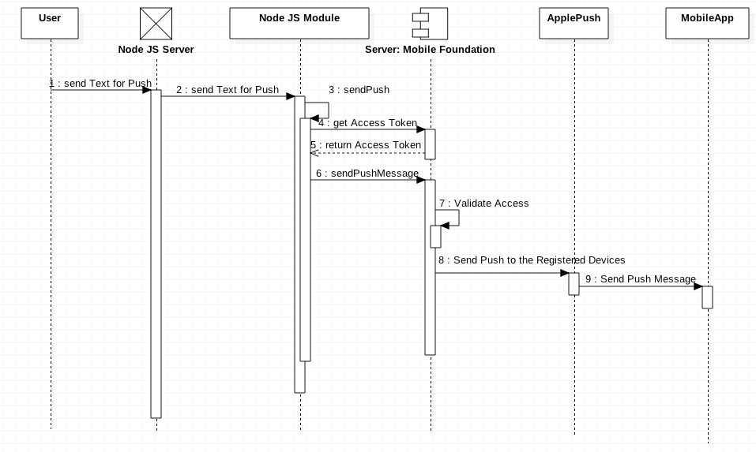
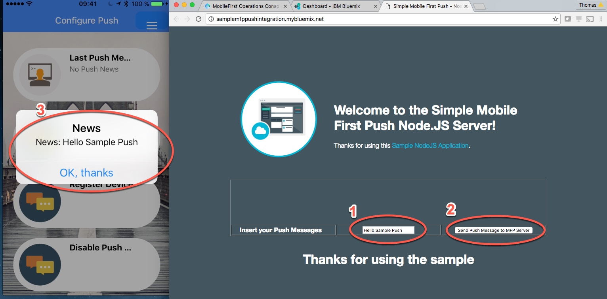

# Using "MobileFirstFoundation Push REST API Version 8" on a Node JS Server

This project is a sample: _How to integrate MFP Push REST API in a Node.js Server?_
I build a Sample Module called ***push*** and you can use it, on you ***own risk***.
The code contains links to information resources, which maybe can be relevant to understand
the implementation.

To get a ***fast start*** in Understanding just take a look in this Video on YouTube:
https://www.youtube.com/edit?o=U&video_id=VbSQpY5hOzU

---
***THIS SAMPLE DOES NOT INCLUDE A MOBILE APP***, I do expect you have a MobileApp with a working push MobileFirstFoundation configuration.

If you do not have a App, a _very good_ sample to do this, you can find here:
https://github.com/MobileFirst-Platform-Developer-Center/PushNotificationsCordova/tree/release80

---
I did the Node.JS APP, because I want to show all the internal ***NodeJS*** dependencies.
For this Sample I used a ***CF Node.js Application with Bluemix*** and as the
***MobileFirstFoundation Server*** I used the _MobileFoundation Service_ on Bluemix.

I have a existing MobileFirst Cordova MobileApp which is registered to this MobileFirstFoundation Server.

To get more details on the Topic on ***MobileFirstFoundation Push*** Topic, please take a
look in the Offical documentation https://mobilefirstplatform.ibmcloud.com/tutorials/en/foundation/8.0/ or other resources like http://mfp.help.

The ***node js module*** is called ***push*** and you can find it in ***own_modules/push.js***.

The module needs to know several information as parameters for the creation and several parameters
when the callback function ***sendPush*** is used.

In the ***git project*** is a sample _Node JS server_ implementation:
How to use the  ***push module***?

To use the module you should know, how the MobileFirstFoundation Push Works.
The focus is **only*** on the ***Push Module***.

---
## Understanding and Overview

This sequence diagram shows the sequence of the **NodeJS Push Module** usage.

The user can insert the message he want to send as Push on the website.
Inside the Node JS Server the function `app.post('/sendPush', function(req, res)` calls
the callback function `pushMFP.sendPush( mfpAppName,mfpServerHostName,mfpServerHostHTTPPort,mfpScopeUser,mfpScopePW,message,function(result)` of the **Node JS Push Module**.
Inside the **node js module** the **MobileFirstFoundation REST API** is used.
First to get the access token to do the push to the MobileFirstFoundation Server.
If the a valid token is received, the push will be executed.
The MobileFirstFoundation Server will check the token and scope, then the server send the push to the
registered push provider like Apple.
Apple sends the Push to the MobileApp.

This is the sample **Node JS app UI** you can use to test the **Node JS "push module"**.

1. **Insert your message** you want to sendPush
2. **Press the Button** to send the Push Message
3. Verify the Push on your MobileApp build with MobileFirstFoundation

---
### Setup of the Push Module
The relevant code for setup the **push module** in the **app.js file**
https://github.com/thomassuedbroecker/MobileFirstPushV8OnNodeJS/blob/master/app.js

In the app file you have to configure the following Variables to your needs.

        //******************************************************************************
        // Variables for the Module Usage - Push with MobileFirstFoundation service
        var mfpAppName = 'YOUR APPLICATION NAME sample (com.tsuedbro.mytravelblog)';
        var mfpScopeUser = "YOUR SCOPE USER sample (test)";
        var mfpScopePW = "YOUR SCOPE USER PASSWORD  sample (test)";
        var mfpServerHostName = 'YOUR MFP Server sample";
        var mfpServerHostHTTPPort = 80; //'YOUR PORT sample (80)';
        var mfpGetPushTokenPath = '/mfp/api/az/v1/token'; // This is the Tokenpath which will not be changed,
                                                          // for more details take a look in the offical documentation
        var mfpGetPushTokenScopeApp = 'push.application.';
        var mfpGetPushTokenScopeCommand = '+messages.write'; // This command will mostlikly not be changed,
                                                             // for more details take a look in the offical documentation
        var mfpGetPushTokenScopeApp = "push.application.";//'YOUR DEFINITION FOR THE SCOPE sample (push.application.)';
        var mfpGetPushTokenScopeData = "grant_type=client_credentials&scope="; // This command will mostlikly not be changed,
                                                                               // for more details take a look in the offical documentation

        var mfpSendPushPath = '/imfpush/v1/apps/';// This command will mostlikly not be changed,
                                                  // for more details take a look in the offical documentation
        var mfpSendPushPathType = '/messages'; // This command will mostlikly not be changed,
                                               // for more details take a look in the offical documentation

        //******************************************************************************
        // Own Modules to load
        var PushMFP = require('./own_modules/push');
        var pushMFP = new PushMFP (mfpGetPushTokenScopeData,
                                   mfpGetPushTokenPath,
                                   mfpGetPushTokenScopeApp,
                                   mfpGetPushTokenScopeCommand,
                                   mfpSendPushPath,
                                   mfpSendPushPathType);

---
### Usage of the Push Module

The `app.post('/sendPush', function(req, res)` shows the usage of the **Push Module**.
In this function you verify the input message, which should be send as a Push and the you use the
callback function of the **Push Module** to send the _Push Message_.

https://github.com/thomassuedbroecker/MobileFirstPushV8OnNodeJS/blob/master/app.js

       /*************************************************
           Doing Push
        **************************************************/
       app.post('/sendPush', function(req, res){
           console.log('>>> send Push : ' + req);
           console.log('>>> req.body  : ( %s ) ', JSON.stringify(req.body));
           var input   = req.body.message;
           var message = "Hey this is a Push Message form the Node.js Server";
           if ( req.body.message != undefined ){
             message = input;
           }
           var theResult = JSON.stringify(input);

           pushMFP.sendPush( mfpAppName,
                             mfpServerHostName,
                             mfpServerHostHTTPPort,
                             mfpScopeUser,
                             mfpScopePW,
                             message,
                             function(result){
             console.log("--> Sending a Push Message: ", message);
             message = {'result': result};
             theResult = JSON.stringify(message);
             res.end(theResult);
           });
       });
---
## Run the node.js app on your Bluemix

1. [Install Node.js][]
2. Download and extract the **MobileFirstPushV8OnNodeJS** here from github
3. cd into the app directory
4. Do the needed customization of the variables in the **app.js** file, you can find in **Setup of the Push Module**.
5. Ensure to deploy into the My Project Region sample US: `cf api https://api.ng.bluemix.net`
6. Login to your Bluemix Area: `cf login`
7. Show your existing apps: `cf apps`
8. Just push the app into your Bluemix Instance: `cf push SampleMFPPushIntegration`
9. See the logs of your app: `cf logs SampleMFPPushIntegration`

[Install Node.js]: https://nodejs.org/en/download/
