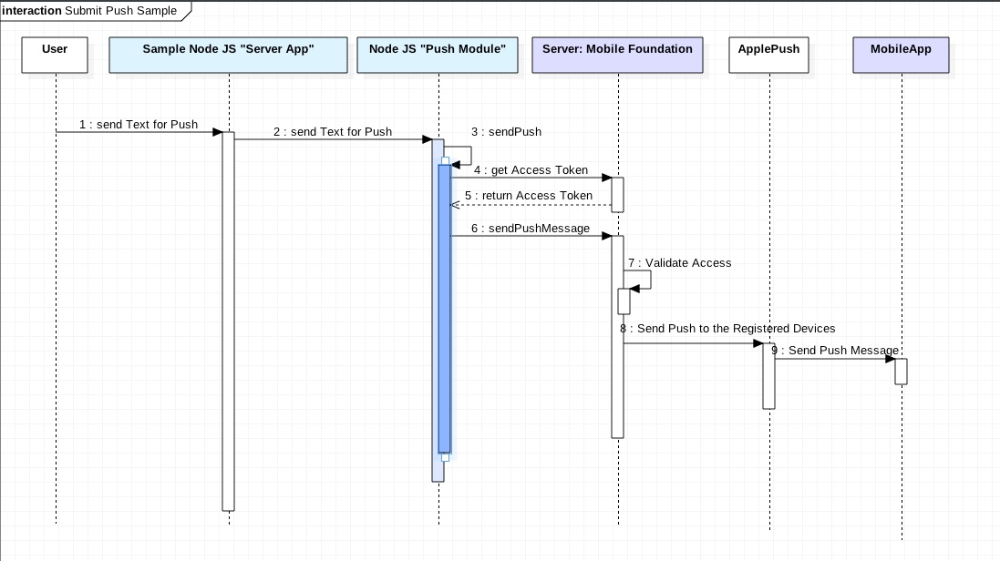

# Using MobileFirstFoundation Push Version 8O on a Node JS Server

This project is a sample: _How to integrate MFP Push REST API in a Node.js Server?_
I build a Sample Module you can use on you own risk.

The code contains links to information resources which maybe can be relevant to understand
the implementation.

To show all the dependencies, I created a CF Node.js Application with Bluemix and as
MobileFirstFoundation Server I used the MobileFoundation Service on Bluemix.

To get more details on the Topic on MobileFirstFoundation Push Topic, please take a
look in the Offical documentation https://mobilefirstplatform.ibmcloud.com/tutorials/en/foundation/8.0/ or other resources like mfp.help.

The **node js module** is called ***push*** and you can find in in ***own_modules/push.js***.

The module needs to know several information as parameter for the creation and several parameter
when the callback function ***sendPush*** is used.

In the **git project** is a sample _Node JS server_ implementation: How to use the  **push module**?

This sequence diagram shows the sequence of the usage.

This is the sample Node JS app you can us to test the push module.

The relevant code for setup the module in the **app.js file**

        //******************************************************************************
        // Variables for the Module Usage - Push with MobileFirstFoundation service
        var mfpAppName = 'YOUR APPLICATION NAME sample (com.tsuedbro.mytravelblog)';
        var mfpScopeUser = "YOUR SCOPE USER sample (test)";
        var mfpScopePW = "YOUR SCOPE USER PASSWORD  sample (test)";
        var mfpServerHostName = 'YOUR MFP Server sample";
        var mfpServerHostHTTPPort = 80; //'YOUR PORT sample (80)';
        var mfpGetPushTokenPath = '/mfp/api/az/v1/token'; // This is the Tokenpath which will not be changed,
                                                          // for more details take a look in the offical documentation
        var mfpGetPushTokenScopeApp = 'push.application.';
        var mfpGetPushTokenScopeCommand = '+messages.write'; // This command will mostlikly not be changed,
                                                             // for more details take a look in the offical documentation
        var mfpGetPushTokenScopeApp = "push.application.";//'YOUR DEFINITION FOR THE SCOPE sample (push.application.)';
        var mfpGetPushTokenScopeData = "grant_type=client_credentials&scope="; // This command will mostlikly not be changed,
                                                                               // for more details take a look in the offical documentation

        var mfpSendPushPath = '/imfpush/v1/apps/';// This command will mostlikly not be changed,
                                                  // for more details take a look in the offical documentation
        var mfpSendPushPathType = '/messages'; // This command will mostlikly not be changed,
                                               // for more details take a look in the offical documentation

        //******************************************************************************
        // Own Modules to load
        var PushMFP = require('./own_modules/push');
        var pushMFP = new PushMFP (mfpGetPushTokenScopeData,
                                   mfpGetPushTokenPath,
                                   mfpGetPushTokenScopeApp,
                                   mfpGetPushTokenScopeCommand,
                                   mfpSendPushPath,
                                   mfpSendPushPathType);

## Run the app locally

1. [Install Node.js][]
2. Download and extract the starter code from the Bluemix UI
3. cd into the app directory
4. Run `npm install` to install the app's dependencies
5. Run `npm start` to start the app
6. Access the running app in a browser at http://localhost:6001

[Install Node.js]: https://nodejs.org/en/download/
